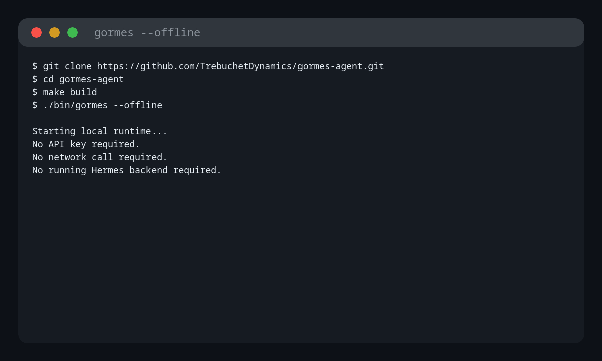

<p align="center">
  
</p>

<p align="center">
  <strong>AI agents that don't break when your environment does.</strong><br>
  A single static binary. No Python. No pip. No Docker daemon.
</p>

<p align="center">
  <a href="https://docs.gormes.ai/"></a>
  <a href="https://github.com/TrebuchetDynamics/gormes-agent/actions/workflows/ci.yml"></a>
  <a href="https://github.com/TrebuchetDynamics/gormes-agent/releases/latest"></a>
  <a href="LICENSE"></a>
  <a href="https://github.com/TrebuchetDynamics/gormes-agent"></a>
</p>

---



`gormes --offline` starts locally with no API key, no network calls, and no Python runtime.

Gormes is a Go-native runtime for AI agents, packaged as a single Go binary. It keeps the TUI, provider turns, local memory, gateways, diagnostics, and setup flows behind one command, so setup is a checklist instead of a Python environment.

Gormes is a Go-native rewrite of Hermes-Agent, with upstream Git history preserved for attribution and Hermes-compatible agent behavior carried forward in Go.

## Install

Two promoted install paths are supported. Both end with the `gormes` command and start with offline verification before provider credentials are needed.

Build from source:

```bash
git clone https://github.com/TrebuchetDynamics/gormes-agent.git
cd gormes-agent
make build
export PATH="$PWD/bin:$PATH"
gormes doctor --offline
gormes --offline
```

Or use the source-backed installer:

```bash
curl -fsSLO https://gormes.ai/install.sh
less install.sh
sh install.sh
gormes doctor --offline
gormes --offline
```

The installer clones or updates a managed checkout, builds the `gormes` command from source, verifies `gormes version`, runs `gormes doctor --offline`, then starts `gormes setup` when a terminal is available. Use `--skip-setup` to defer that wizard.

## First Run

Want the fastest proof?

```bash
gormes doctor --offline
gormes --offline
```

Then complete the provider-backed path:

```bash
gormes doctor --offline
gormes onboard
gormes setup provider
gormes --oneshot "hello"
```

| Command | What it proves |
|---|---|
| `gormes doctor --offline` | Local runtime, TUI, tools, gateway checks, and local SQLite memory ("Goncho") are wired without using credentials. |
| `gormes onboard` | Shows your config path, skills, agents, channel bindings, missing provider state, and next commands. |
| `gormes setup provider` | Interactively picks endpoint, provider, model, and API key. Secrets go to `~/.gormes/.env`; config goes to `~/.gormes/config.toml`. |
| `gormes --oneshot "hello"` | Sends one provider-backed turn and exits. If this works, the TUI and gateway have a model to use. |

## Daily Use

```bash
gormes                     # open the native TUI
gormes onboard --wizard    # guided first-run readiness plan
gormes dashboard           # web UI at http://127.0.0.1:43827/dashboard
gormes gateway             # run the configured messaging gateway
gormes gateway status      # inspect gateway runtime state
gormes gateway reload      # reload swappable gateway config without restart
gormes logs                # read recent gateway logs
```

## Multi-Agent Routing

```bash
gormes setup agent         # print agent/profile setup guidance
gormes setup workspace     # set the default workspace path
gormes setup bindings      # route channels to specific agents
gormes onboard             # review the active routes
```

The default agent is ready after install. Add more when you need separate workspaces, models, or channel ownership.

## What You Get

| Surface | Current path |
|---|---|
| Install | Source build or inspectable `install.sh`, with one Go command and no Python runtime. |
| Setup | `gormes onboard` for state, `gormes onboard --wizard` for guided readiness, and `gormes setup provider` for model/API-key setup. |
| Providers | OpenAI-compatible endpoints and major providers: OpenAI, Anthropic, DeepSeek, Groq, Ollama, OpenAI Codex, OpenCode, and custom endpoints. |
| Memory | Local SQLite memory ("Goncho") and sessions inside `~/.gormes`. |
| Gateway | One gateway process with runtime-ready Telegram, Discord, and Slack setup paths; additional adapters are tracked in the roadmap. |
| Operations | `doctor`, `config show`, `gateway status`, `gateway reload`, `logs`, `dashboard`, `security audit`, and `secrets audit` commands. |

## Why People Switch

| | Other agents | Gormes |
|---|---|---|
| **Install** | pip, venvs, system packages | Source build or inspectable `install.sh` to one Go command |
| **First setup** | Find and edit config files | `gormes onboard`, optional wizard, then `gormes setup provider` |
| **Smoke test** | Needs a live model first | `gormes doctor --offline` and `gormes --offline` |
| **State** | Redis, vector DBs, sidecars | SQLite under `~/.gormes` |
| **Channels** | Separate bot glue per platform | One gateway process with channel bindings |
| **Release trust** | Ad-hoc local environments | Tagged release assets with SHA-256, SBOMs, and CI validation; signing and package-manager lanes are still hardening |

## Operator Cheatsheet

```bash
gormes config show              # redacted config
gormes config edit              # open ~/.gormes/config.toml
gormes onboard --wizard         # guided first-run readiness plan
gormes setup model              # select the default model
gormes auth add <provider>      # add or refresh credentials
gormes security audit --deep    # inspect gateway, tool, and state security
gormes secrets audit --plan file
gormes uninstall                # remove local Gormes artifacts
```

## Build From Source

```bash
git clone https://github.com/TrebuchetDynamics/gormes-agent.git
cd gormes-agent
make build
export PATH="$PWD/bin:$PATH"
gormes version
gormes doctor --offline
go test ./... -count=1
go run ./cmd/progress validate
```

## Docs

[Installation](https://docs.gormes.ai/getting-started/installation/) ·
[First run](https://docs.gormes.ai/getting-started/first-run/) ·
[CLI reference](https://docs.gormes.ai/reference/cli/) ·
[Providers](https://docs.gormes.ai/reference/providers/) ·
[Configuration](https://docs.gormes.ai/reference/config/) ·
[Gateway](https://docs.gormes.ai/building-gormes/core-systems/gateway/) ·
[Troubleshooting](https://docs.gormes.ai/getting-started/troubleshooting/) ·
[Roadmap](https://docs.gormes.ai/building-gormes/architecture_plan/)

## Security & Trust

- Source build and inspectable `install.sh` are the recommended scout-release paths.
- `gormes doctor --offline` and `gormes --offline` prove local readiness before token spend.
- Provider secrets stay local under `~/.gormes/.env`; config stays under `~/.gormes/config.toml`.
- Binary size and public benchmark mirrors come from repo data, not hand-tuned marketing copy.
- Release signing and package-manager installs are still active hardening work.

## Status

Early 0.x release.

Working today:

- TUI, onboarding, setup, and offline local smoke tests
- Provider-backed one-shot turns and major provider setup paths
- Gateway paths for Telegram, Discord, and Slack
- Local SQLite memory, dashboard, logs, doctor, and security/secrets audits

In progress:

- Full Hermes runtime parity
- More channels and gateway hardening
- Deeper learning-loop, MCP/plugin, voice/TTS, and release-distribution work

Latest public release: [v0.1.02](https://github.com/TrebuchetDynamics/gormes-agent/releases/tag/v0.1.02).

<details>
<summary>Roadmap phase rollup</summary>

<!-- PROGRESS:START kind=readme-rollup -->
| Phase | Status | Shipped |
|-------|--------|---------|
| Phase 1 — The Dashboard | ✅ | 4/4 subphases |
| Phase 2 — The Gateway | 🔨 | 20/21 subphases |
| Phase 3 — The Black Box (Memory) | ✅ | 15/15 subphases |
| Phase 4 — The Brain Transplant | 🔨 | 10/13 subphases |
| Phase 5 — The Final Purge | 🔨 | 4/22 subphases |
| Phase 6 — The Learning Loop (Soul) | 🔨 | 7/12 subphases |
| Phase 7 — Paused Channel Backlog | 🔨 | 2/5 subphases |
<!-- PROGRESS:END -->

</details>

Release v0.1.02 publishes static Go binaries for Linux, macOS, and Windows on amd64/arm64. The current benchmark mirror reports a Linux build at ~38.6 MB (`benchmarks.json`, 2026-05-04). CI runs `go test ./... -count=1`, `go run ./cmd/progress validate`, and `git diff --check`. See [CHANGELOG.md](CHANGELOG.md) and [SECURITY.md](SECURITY.md).

---

Built by [Trebuchet Dynamics](https://trebuchetdynamics.com/).
Hermes Agent lineage by [Nous Research](https://nousresearch.com).
MIT license.
