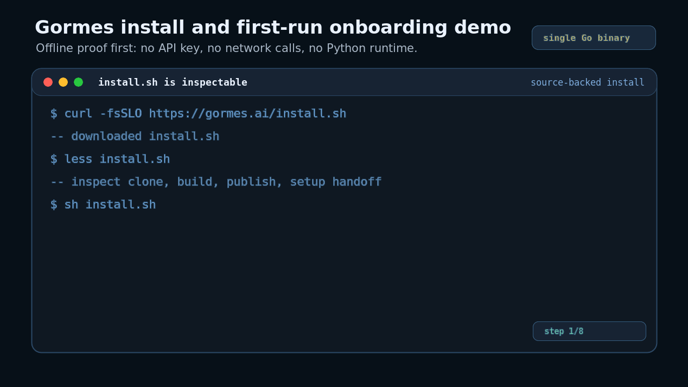

<p align="center">
  
</p>

<p align="center">
  <strong>Run Hermes-compatible agents from one Go binary.</strong><br>
  Gormes is a Go-native runtime for providers, tools, skills, local SQLite memory, sessions, dashboard, and chat gateways in one static binary. It brings the Hermes agent shape to Termux, Windows-without-Python, and locked-down Linux hosts: no pip, no venv, no Docker daemon. The bundled skill set covers the 30 most-used Hermes skills, including coding, GitHub, browser/web tools, research, productivity, and media workflows.
</p>

<p align="center">
  <a href="https://docs.gormes.ai/"></a>
  <a href="https://github.com/TrebuchetDynamics/gormes-agent/actions/workflows/ci.yml"></a>
  <a href="https://github.com/TrebuchetDynamics/gormes-agent/releases/latest"></a>
  <a href="LICENSE"></a>
  <a href="https://github.com/TrebuchetDynamics/gormes-agent"></a>
</p>

---

<p align="center">
  
</p>

Gormes is not a micro-agent. It keeps the broad Hermes agent architecture and makes it portable, inspectable, and cheap to operate from a normal terminal.

The demo above is a real operator path: install, setup, provider setup, first task, web tools, Termux, and gateway.

## At A Glance

| Signal | Current evidence |
|---|---|
| Runtime shape | One Go binary for CLI, TUI, provider turns, tools, skills, memory, sessions, dashboard, and gateways |
| Install proof | `gormes doctor --offline` and `gormes --offline` run before any provider token is needed |
| Release artifact | Linux build ~47.7 MB; no local Python, Node, Redis, vector DB, or Docker daemon required |
| Bundled skills | 30 Hermes skills across coding, GitHub, browser/web, research, productivity, and media workflows |
| Local state | SQLite under `~/.gormes`; no Redis, vector DB, Python service, or Node service on the local path |
| Stable channels | Telegram, Discord, and Slack through one gateway process |
| Release posture | Useful today for CLI/TUI, provider turns, local state, and Telegram/Discord/Slack; voice/TTS, release signing, package-manager lanes, and remaining parity gaps are on the roadmap |

## Quick Install

**Linux, macOS, WSL2:**

```bash
curl -fsSL https://gormes.ai/install.sh | bash
```

**Windows (native PowerShell):**

```powershell
irm https://raw.githubusercontent.com/TrebuchetDynamics/gormes-agent/main/scripts/install.ps1 | iex
```

> Both installers are user-scoped. For audit-first installs, download the script, read it, then run it.

After installation:

```bash
gormes version
gormes doctor --offline
gormes setup
gormes chat
```

That is the shortest path: verify the installed binary, prove the runtime locally before credentials, configure provider/model, then open a provider-backed terminal chat. The proof path is no-stack local ownership: no pip, no venv, no Docker daemon.

## First Setup

```bash
gormes version               # confirm the binary on PATH
gormes doctor --offline      # local runtime, TUI, gateway, memory — no credentials needed
gormes setup                 # guided setup for provider, model, terminal, gateway, tools
gormes setup provider        # direct provider setup shortcut
gormes chat                  # provider-backed terminal chat
gormes --offline             # native TUI, no network
```

If `gormes chat` opens, the TUI and gateway have a model to use.

## Built For

- Developers who want a real agent runtime without Python environment drift.
- Operators who need offline diagnostics before adding provider credentials.
- Small servers, Termux/Android, WSL2, and locked-down Linux hosts where Docker or venv repair is friction.
- Termux can be the controller while a remote SSH host handles Docker, browser automation, GPU/local models, and large builds.
- Long-running personal or team agents that need local sessions, memory, tools, and chat gateways.

Not yet for teams that require signed enterprise releases, voice/TTS parity, or every Hermes channel on day one.

## What Works Today

| Surface | Status |
|---|---|
| Install, offline smoke, doctor, dashboard | **Supported** |
| CLI-first setup/config, TUI, scripted chat, multi-agent routing | **Supported** |
| Providers: OpenAI, Anthropic, DeepSeek, Groq, Ollama, OpenAI Codex, OpenCode, custom endpoints | **Supported** |
| Local SQLite memory (Goncho), session state | **Supported** |
| Gateways: Telegram, Discord, Slack | **Supported** |
| Profiles, local Kanban board, skills/plugins inventory, security/secret audits | **Supported** |
| Hermes / OpenClaw migration with dry-run | **Supported** |
| Gateways: WhatsApp, Teams, Yuanbao | **Experimental** |
| Learning loop, MCP/plugin parity, voice/TTS | **Roadmap** |
| Release signing, package-manager lanes | **Roadmap** |

Detailed parity status by phase lives in the [roadmap](https://docs.gormes.ai/building-gormes/architecture_plan/).

## Why People Switch

| | Other agents | Gormes |
|---|---|---|
| **Install** | pip, venvs, system packages | One Go command from `install.sh` |
| **First setup** | Find and edit config files | `gormes setup` |
| **Smoke test** | Needs a live model first | `gormes doctor --offline` and `gormes --offline` |
| **State** | Redis, vector DBs, sidecars | SQLite under `~/.gormes` |
| **Channels** | Separate bot glue per platform | One gateway process with channel bindings |
| **Footprint claims** | Often anecdotal | Release assets and binary size recorded from `benchmarks.json`; no Python/Node sidecar on the local path |
| **Release trust** | Ad-hoc local environments | Tagged release assets with SHA-256 + SBOMs |

## How It Works

Gormes follows the Hermes agent shape, but moves the operational surface into Go:

1. `cmd/gormes` owns the CLI, setup, TUI entry point, dashboard, and gateway commands.
2. `internal/kernel` runs the turn loop shared by the TUI, one-shot chat, and channel gateway.
3. `internal/provider` and `internal/hermes` adapt OpenAI-compatible, Anthropic, DeepSeek, Groq, Ollama, Codex, OpenCode, and custom endpoints.
4. `internal/tools` and `internal/skills` expose the tool and skill registry without a Python sidecar.
5. `internal/goncho`, `internal/memory`, and `internal/session` keep local memory and session state inspectable in SQLite.

## Daily Use

```bash
gormes                          # open the native TUI
gormes setup                    # guided setup and reconfiguration
gormes setup --quick            # fill missing setup items only
gormes dashboard                # web UI at http://127.0.0.1:43827/dashboard
gormes config show              # inspect config with secrets redacted
gormes profile use <name>       # switch isolated profile homes
gormes gateway                  # run the configured messaging gateway
gormes gateway status --json    # inspect gateway runtime state
gormes logs                     # read recent gateway logs
```

### CLI vs Gateway

| Action | Local CLI | Messaging gateway |
|---|---|---|
| Start chatting | `gormes` | Run `gormes gateway`, then message the configured channel bot. |
| Start provider-backed chat | `gormes chat` | Send a normal message after provider setup. |
| Configure provider/model | `gormes setup provider` | Run setup locally, then `gormes gateway reload`. |
| Diagnose runtime issues | `gormes doctor --offline`, `gormes logs` | `gormes gateway status`, then fix config or credentials locally. |

## Migrating From Hermes Or OpenClaw

Always dry-run first and review the redacted manifest before applying.

```bash
gormes migrate hermes   --dry-run --source ~/.hermes
gormes migrate hermes   --yes     --source ~/.hermes

gormes migrate openclaw --dry-run --source ~/.openclaw
gormes migrate openclaw --yes     --source ~/.openclaw
gormes migrate openclaw --yes --secrets --source ~/.openclaw
```

OpenClaw cleanup archives old directories rather than deleting them:

```bash
gormes migrate openclaw cleanup --dry-run
gormes migrate openclaw cleanup --yes
```

## Build From Source

```bash
git clone https://github.com/TrebuchetDynamics/gormes-agent.git
cd gormes-agent
make build
export PATH="$PWD/bin:$PATH"
gormes doctor --offline
```

## Docs

| Section | What it covers |
|---|---|
| [Installation](https://docs.gormes.ai/getting-started/installation/) | Source build, installer path, PATH, and offline verification. |
| [First run](https://docs.gormes.ai/getting-started/first-run/) | `doctor`, `setup`, provider setup, and first provider-backed turn. |
| [What you can do](https://docs.gormes.ai/guides/what-you-can-do/) | Outcome-driven recipes for CLI, config, gateway, profiles, memory, and security. |
| [CLI reference](https://docs.gormes.ai/reference/cli/) | Commands, flags, and operator workflows. |
| [Providers](https://docs.gormes.ai/reference/providers/) | Supported provider config and credential paths. |
| [Configuration](https://docs.gormes.ai/reference/config/) | `~/.gormes/config.toml`, `.env`, agents, workspaces, and bindings. |
| [Gateway](https://docs.gormes.ai/building-gormes/core-systems/gateway/) | Channel runtime, status checks, reloads, and troubleshooting evidence. |
| [Troubleshooting](https://docs.gormes.ai/getting-started/troubleshooting/) | Common install, provider, gateway, and browser-tool failures. |
| [Roadmap](https://docs.gormes.ai/building-gormes/architecture_plan/) | Hermes parity phases, status labels, and progress evidence. |

## Security & Trust

- `gormes doctor --offline` and `gormes --offline` prove local readiness before any token spend.
- Provider secrets stay local under `~/.gormes/.env`; config under `~/.gormes/config.toml`.
- Tagged releases publish a single static binary per target plus SHA-256 checksums and SBOMs. Release signing and package-manager lanes remain on the roadmap.
- The `curl … | sh` install path is validated by an end-to-end suite ([`tests/install/e2e.sh`](tests/install/e2e.sh)) covering API outage with redirect fallback, SHA-256 mismatch abort, SSH-origin update fallback to public HTTPS, hosts without Go/curl/wget/systemd, Termux detection, sudo'd root install, and `--uninstall --dry-run` preview. Runnable locally or via the [`install-e2e`](.github/workflows/install-e2e.yml) workflow on demand.

## Engineering Evidence

Gormes is ported against Hermes behavior in small, test-backed slices. This process is here for auditability; the product pitch is the runtime you can install and run.

- Roadmap: [Hermes parity phases](https://docs.gormes.ai/building-gormes/architecture_plan/)
- Strategy: [Gormes Success Plan](docs/content/building-gormes/strategy/success-plan.md)
- Engineering blog: [TrebuchetDynamics Engineering](https://engineering.trebuchetdynamics.com/) ([RSS](https://engineering.trebuchetdynamics.com/feed.xml))
- Differentiator: [v1.0 differentiator](docs/content/building-gormes/strategy/v1-differentiator.md)
- Development workflow: [repo-local development skills](docs/development-skills/) track the planner, builder, and TDD-slice process.
- Future toolkit extraction (`agentic-porting-kit`): tracked as a Phase 8 row.

Hermes-Agent, with upstream Git history preserved for attribution, remains the behavior reference.

## Status

Latest public release: [v0.2.22](https://github.com/TrebuchetDynamics/gormes-agent/releases/tag/v0.2.22) (`v2026.5.23`).

Termux/Android status: `v0.2.22` carries forward the installer recovery for the `v0.2.20` Termux executable-argument issue. Affected users should reinstall from the latest release and verify with `gormes version` plus `gormes doctor --offline`.

CI runs `go test ./... -count=1`, `go run ./cmd/progress validate`, and `git diff --check`. Release assets ship for Linux, macOS, Windows, and Termux/Android with SHA-256 checksums and SBOMs. The current Linux build measures ~47.7 MB (`benchmarks.json`).

<details>
<summary>Roadmap phase rollup</summary>

<!-- PROGRESS:START kind=readme-rollup -->
| Phase | Status | Shipped |
|-------|--------|---------|
| Phase 1 — The Dashboard | ✅ | 6/6 subphases |
| Phase 2 — The Gateway | ✅ | 22/22 subphases |
| Phase 3 — The Black Box (Memory) | ✅ | 16/16 subphases |
| Phase 4 — The Brain Transplant | ✅ | 13/13 subphases |
| Phase 5 — The Final Purge | 🔨 | 22/23 subphases |
| Phase 6 — The Learning Loop (Soul) | ✅ | 12/12 subphases |
| Phase 7 — Paused Channel Backlog | ✅ | 5/5 subphases |
| Phase 8 — Reputation & Publication | 🔨 | 4/7 subphases |
| Phase 9 — Design & Security Hardening | 🔨 | 6/7 subphases |
<!-- PROGRESS:END -->

</details>

See [CHANGELOG.md](CHANGELOG.md) and [SECURITY.md](SECURITY.md).

---

Built by [Trebuchet Dynamics](https://trebuchetdynamics.com/).
Hermes Agent lineage by [Nous Research](https://nousresearch.com).
MIT license.
